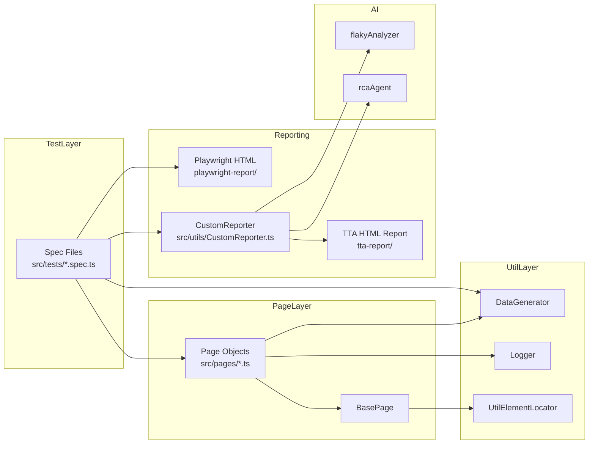

<div align="center">

# 🎭 Advance Playwright Framework 2X

### A Production-Ready Test Automation Framework Built on Playwright + TypeScript

[](https://playwright.dev)
[](https://www.typescriptlang.org)
[](https://nodejs.org)
[](LICENSE)

**Page Objects • Custom HTML Reporter • AI Root-Cause Analysis • Faker Data Generation • Winston Logging • CI-Ready**

</div>

---

## 📋 Table of Contents

- [✨ Overview](#-overview)
- [🧱 Tech Stack](#-tech-stack)
- [📂 Project Structure](#-project-structure)
- [🚀 Getting Started](#-getting-started)
- [⚙️ Configuration](#️-configuration)
- [🏗️ Framework Architecture](#️-framework-architecture)
- [📝 Writing Tests](#-writing-tests)
- [AI-Assisted Playwright Workflows](#ai-assisted-playwright-workflows)
- [🧩 Page Objects](#-page-objects)
- [🛠️ Utilities](#️-utilities)
- [📊 Reports & Artifacts](#-reports--artifacts)
- [🤖 AI-Powered Analysis](#-ai-powered-analysis)
- [🔁 Flaky Test Detection](#-flaky-test-detection)
- [🌐 Environment Management](#-environment-management)
- [🤖 CI/CD Integration](#-cicd-integration)
- [🧪 Running Tests](#-running-tests)
- [❓ Troubleshooting](#-troubleshooting)
- [🤝 Contributing](#-contributing)

---

## ✨ Overview

**Advance Playwright Framework 2X** is a complete, ready-to-extend test automation framework for web applications. It's built around the **Page Object Model (POM)** pattern and demonstrates industry best practices:

| Capability | What you get |
|---|---|
| 🖥️ **Cross-browser** | Chromium, Firefox, WebKit (switch in `playwright.config.ts`) |
| 🧩 **Page Object Model** | Clean separation between test logic and UI selectors |
| 🧪 **Data-driven ready** | Faker-backed data generation, CSV/Excel tooling installed |
| 📊 **Custom HTML Reporter** | Real-time, self-contained report with video, trace & screenshots |
| 🤖 **AI Root-Cause Analysis** | Optional LLM-powered failure verdicts (RCA) |
| 🔁 **Flaky Test Analyzer** | Auto-compares builds to flag flaky tests |
| 📝 **Winston Logging** | Scoped, timestamped logs to console + `logs/combined.log` |
| 🤖 **CI/CD Ready** | GitHub Actions workflow included |

---

## 🧱 Tech Stack

| Layer | Technology |
|---|---|
| **Test Runner** | [Playwright](https://playwright.dev) `^1.62` |
| **Language** | [TypeScript](https://www.typescriptlang.org) (strict mode) |
| **Runtime** | Node.js LTS (CommonJS) |
| **Page Objects** | Custom POM classes (`src/pages/`) |
| **Reporting** | Custom HTML Reporter + Playwright HTML + List |
| **Logging** | [Winston](https://github.com/winstonjs/winston) `^3.19` |
| **Data Generation** | [Faker](https://fakerjs.dev) `^10.5` |
| **Data Tooling** | csv-parse, xlsx, jsonpath-plus, ajv |
| **AI Analysis** | Optional LLM API keys (OpenAI / Anthropic / Gemini) |
| **CI** | GitHub Actions (`ubuntu-latest`, Node LTS) |

---

## 📂 Project Structure

```text
advanceplaywrightframework2x/
├── .env                          # Environment variables (SHIPPED with the repo)
├── .claude/
│   ├── commands/
│   │   └── gogo.md                # README, verification, commit, and push workflow
│   └── skills/                    # Task-specific Playwright agent playbooks
├── .github/
│   ├── workflows/
│   │   └── playwright.yml        # CI: install, run tests, upload report
│   └── copilot-instructions.md   # Repository conventions for GitHub Copilot
├── docs/                         # Additional documentation (extend me)
├── learnings/                    # Implementation notes and repeatable lessons
├── logs/                         # Winston runtime logs (combined.log)
├── playwright-report/            # Playwright's built-in HTML report output
├── reports/
│   └── runs/                     # Build snapshots for the Flaky analyzer
├── rules/                        # Project rules / conventions (extend me)
├── src/
│   ├── ai/                       # AI-powered reporter agents
│   │   ├── agents/
│   │   │   ├── rcaAgent.ts       # Root-Cause Analysis (failure verdicts)
│   │   │   └── flakyAnalyzer.ts  # Build-vs-build flaky detection
│   │   └── config/
│   │       └── providers.ts      # LLM provider detection (hasApiKey)
│   ├── api/                      # API layer (extend me)
│   ├── config/                   # Config helpers
│   │   ├── env.ts                # .env loader (requireEnv / envOr / assertEnv)
│   │   ├── credentials.ts        # Standard-user credentials from env
│   │   └── reportConfig.ts       # 🎚️ ATTACH_SCREENSHOTS flag (screenshots/video/trace)
│   ├── fixtures/
│   │   └── test-base.ts          # Pre-wired `test` with a fixture per Page Object
│   ├── pages/                    # 🧩 Page Object Model classes
│   │   ├── BasePage.ts           # Shared scaffolding for all pages
│   │   ├── LoginPage.ts
│   │   ├── InventoryPage.ts
│   │   ├── ItemDetailPage.ts
│   │   ├── CartPage.ts
│   │   ├── CheckoutStepOnePage.ts
│   │   ├── CheckoutStepTwoPage.ts
│   │   └── CheckoutCompletePage.ts
│   ├── testdata/                 # Static / dynamic test data
│   │   └── logintestdata.json    # Login users (standard, locked-out, etc.)
│   ├── tests/                    # 🧪 Playwright specs (testDir)
│   │   ├── login/
│   │   │   └── login.spec.ts
│   │   ├── e2e/
│   │   │   ├── e2e-checkout.spec.ts      # Checkout flow (hardcoded item)
│   │   │   └── e2e-checkout_new_fixture.spec.ts
│   │   ├── login.spec.ts
│   │   └── example.spec.ts
│   └── utils/                    # 🛠️ Shared utilities
│       ├── CustomReporter.ts     # 🎭 Custom TTA HTML reporter
│       ├── DataGenerator.ts      # Faker-backed fake data
│       ├── UtilElementLocator.ts # Reusable element actions
│       ├── visualStep.ts         # test.step wrapper + optional step screenshots
│       └── logger.ts             # Winston logger
├── test-results/                 # Failure artifacts (screenshots/videos/traces)
├── tta-report/                   # 🎭 Custom reporter output (HTML + assets)
├── .gitignore
├── package.json
├── playwright.config.ts          # ⚙️ Main Playwright configuration
└── tsconfig.json                 # TypeScript config + @ path aliases
```

---

## 🚀 Getting Started

### 1. Prerequisites

- **[Node.js](https://nodejs.org) LTS** (18.x or 20.x recommended)
- **npm** (comes with Node.js)
- **Git** (for cloning)

### 2. Clone & Install

```bash
# Clone the repository
git clone <your-repo-url>
cd AdvancePlaywrightFramework2X

# Install project dependencies
npm install

# Install Playwright browsers (Chromium, Firefox, WebKit)
npx playwright install

# (Optional) Install system dependencies for Linux CI
npx playwright install --with-deps
```

### 3. Configure Environment

The `.env` file **ships with the repository** — everything is pre-configured, so a fresh clone runs out of the box:

```env
TTA_ENV=qa
BASE_URL=https://app.thetestingacademy.com
QA_BASE_URL=https://app.thetestingacademy.com
STG_BASE_URL=https://stage.thetestingacademy.com
PROD_BASE_URL=https://app.thetestingacademy.com
DEV_BASE_URL=http://localhost:3000
API_BASE_URL=https://restful-booker.herokuapp.com
LOG_LEVEL=info
TEST_ENV=QA
TEST_AUTHOR=Nitesh Kumar
USERNAME=admin
PASSWORD=ADMIN123
OPEN_REPORT=true
ATTACH_SCREENSHOTS=false        # set true to capture screenshots/videos/traces
```

### 4. Run Your First Test

```bash
npx playwright test src/tests/login/login.spec.ts
```

You should see:

- ✅ The test **passes**
- 🎭 A real-time **Nitesh Automation Report** is generated in `tta-report/`
- 🖥️ The **latest report** auto-opens via `tta-report/index.html`

---

## ⚙️ Configuration

### `playwright.config.ts` — the heart of the framework

| Setting | Value | Purpose |
|---|---|---|
| `testDir` | `./src/tests` | Where Playwright looks for specs |
| `timeout` | `60_000` ms | Per-test timeout |
| `expect.timeout` | `10_000` ms | Assertion timeout |
| `fullyParallel` | `true` | Run tests in parallel |
| `retries` | `2` (CI) / `0` (local) | Retry flaky tests in CI |
| `reporter` | `['html', 'list', './src/utils/CustomReporter.ts']` | Playwright HTML + console + custom TTA report |
| `use.baseURL` | Resolved from env | Root URL for relative `goto()` calls |
| `use.screenshot` | From `ATTACH_SCREENSHOTS` | `'only-on-failure'` when true, `'off'` when false |
| `use.video` | From `ATTACH_SCREENSHOTS` | `'on'` when true, `'off'` when false |
| `use.trace` | From `ATTACH_SCREENSHOTS` | `'on'` when true, `'off'` when false |
| `projects` | `chromium` (Desktop Chrome) | Add Firefox/WebKit as needed |

### 🎚️ The `ATTACH_SCREENSHOTS` flag

One env var controls whether screenshots, videos and traces are captured and attached to the TTA report:

| Value | Screenshot | Video | Trace |
|---|---|---|---|
| `true` | On failure + per `visualStep` | Every test | Every test |
| `false` *(default)* | Off | Off | Off |

Set it in `.env` or override per run:

```bash
# Attach everything (steps get screenshots, video + trace recorded)
ATTACH_SCREENSHOTS=true npx playwright test

# Lean/fast runs — nothing captured (this is the default)
npx playwright test
```

### Adding browsers

Add more projects to `playwright.config.ts`:

```ts
projects: [
  { name: 'chromium', use: { ...devices['Desktop Chrome'] } },
  { name: 'firefox',  use: { ...devices['Desktop Firefox'] } },
  { name: 'webkit',   use: { ...devices['Desktop Safari'] } },
]
```

### TypeScript path aliases (`tsconfig.json`)

```json
"paths": {
  "@api/*":       ["src/api/*"],
  "@config/*":    ["src/config/*"],
  "@fixtures/*":  ["src/fixtures/*"],
  "@pages/*":     ["src/pages/*"],
  "@testdata/*":  ["src/testdata/*"],
  "@utils/*":     ["src/utils/*"]
}
```

> These aliases are **auto-resolved by Playwright 1.62+** — no extra bundler needed.

---

## 🏗️ Framework Architecture



**Flow:**

1. **Spec files** (`src/tests/`) define test scenarios using `test`/`expect`.
2. Tests interact with the UI exclusively through **Page Objects** — never raw selectors.
3. Page Objects inherit from **BasePage**, which wires up the locator utility and a scoped logger.
4. Every action goes through **UtilElementLocator** (fill, click, wait, etc.) for consistent behavior + logging.
5. **DataGenerator** provides faker-backed data for test inputs.
6. When the run finishes, **CustomReporter** produces a rich, self-contained HTML report and optionally runs **AI analysis**.

---

## 📝 Writing Tests

Tests live in `src/tests/` and use Playwright's standard API.

### Example — Login spec

```ts
import { test, expect } from '@playwright/test';
import { LoginPage } from '@pages/LoginPage';
import { createLogger } from '@utils/logger';

const log = createLogger('login.spec');

test.describe('TTACart - Login', () => {
    let loginPage: LoginPage;

    test.beforeEach(async ({ page }) => {
        loginPage = new LoginPage(page);
        await test.step('Open the TTACart login page', async () => {
            log.info('Opening the TTACart login page');
            await loginPage.open();
        });
    });

    test('logs in with valid credentials @p0', async ({ page }) => {
        await test.step('Login as standard_user', async () => {
            await loginPage.loginAs('standard_user', 'tta_secret');
        });

        await test.step('Verify login form is no longer shown', async () => {
            await expect(page.locator('[data-test="login-button"]')).toBeHidden();
        });
    });
});
```

### Best practices baked into the framework

- ✅ **Use `@pages/*`, `@utils/*` aliases** — no fragile relative imports.
- ✅ **Wrap actions in `test.step()`** — steps appear in the TTA report with timings.
- ✅ **Never touch selectors directly in specs** — always go through Page Objects.
- ✅ **Tag tests** with `@p0`, `@p1`, `@smoke` — the report supports priority filtering.
- ✅ **Log key actions** via `createLogger()` — every line is timestamped & scoped.

---

## AI-Assisted Playwright Workflows

**Concept:** The repository keeps task-specific agent playbooks in `.claude/skills/`, GitHub Copilot conventions in `.github/copilot-instructions.md`, and a release workflow in `.claude/commands/gogo.md`. The playbooks cover Page Objects, fixtures, test generation, locators, API tests, network mocking, flake and trace analysis, visual regression, accessibility, CI, and feature explainers.

**Why:** The guidance keeps generated tests aligned with the framework's fixture-first Page Object pattern. It prevents common drift such as importing from `@playwright/test` in specs, placing locators in tests, or bypassing `UtilElementLocator`.

**Q&A - why use this?**

- **Which playbook should I use?** Choose the skill matching the task, for example `pw-test-generator` for a new scenario or `pw-flaky-debugger` for an intermittent failure.
- **Can the skills be used outside Claude?** Yes. They use the portable `SKILL.md` layout. Codex can load them as installed skills, and Command Code can load the folder with `commandcode --skill .claude/skills`.
- **What does `gogo` do?** It reviews the changes, updates this README, runs the TypeScript and Playwright checks, then stages, commits, and pushes only the explained files.

```bash
# Start Command Code with the repository's Playwright skills available
commandcode --skill .claude/skills

# In a Codex session where the skills are installed
$pw-test-generator generate a checkout scenario
```

---

## 🧩 Page Objects

Page Objects encapsulate selectors + actions for a screen. They extend `BasePage`.

### `BasePage` — shared scaffolding

```ts
import { Page } from '@playwright/test';
import { UtilElementLocator } from '@utils/UtilElementLocator';
import { createLogger, type Logger } from '@utils/logger';

export abstract class BasePage {
    protected readonly page: Page;
    protected readonly el: UtilElementLocator;
    protected readonly log: Logger;

    protected constructor(page: Page, scope: string) {
        this.page = page;
        this.el = new UtilElementLocator(page, scope);
        this.log = createLogger(scope);
    }

    protected async goto(relativePath: string): Promise<void> {
        await this.page.goto(relativePath);
        await this.page.waitForLoadState('domcontentloaded');
    }
}
```

### Example — `LoginPage`

```ts
export class LoginPage extends BasePage {
    static readonly PATH = '/playwright/ttacart/index.html';

    private readonly usernameInput: Locator;
    private readonly passwordInput: Locator;
    private readonly loginButton: Locator;

    constructor(page: Page) {
        super(page, 'LoginPage');
        this.usernameInput = page.locator('[data-test="username"]');
        this.passwordInput = page.locator('[data-test="password"]');
        this.loginButton = page.locator('[data-test="login-button"]');
    }

    async open(): Promise<void> {
        this.log.info('Open login page');
        await this.goto(LoginPage.PATH);
    }

    async loginAs(username: string, password: string): Promise<void> {
        this.log.info(`loginAs ${username}`);
        await this.el.fill(this.usernameInput, username);
        await this.el.fill(this.passwordInput, password);
        await this.el.click(this.loginButton);
    }
}
```

**How to create a new Page Object:**

1. Create `src/pages/YourPage.ts`.
2. `export class YourPage extends BasePage`.
3. Declare `private readonly` Locator fields in the constructor.
4. Add descriptive methods that use `this.el` for actions.
5. Instantiate it in your spec with `new YourPage(page)`.

---

## 🛠️ Utilities

### `UtilElementLocator` — reusable element actions

A wrapper around Playwright actions with consistent timeouts + debug logging:

| Category | Methods |
|---|---|
| **Mouse** | `click`, `doubleClick`, `rightClick`, `hover` |
| **Input** | `fill`, `type`, `clear`, `pressSequentially` |
| **Text** | `getText`, `getInnerText`, `getAllTexts` |
| **Attributes** | `getAttr`, `getValue` |
| **Count** | `count` |
| **State** | `isVisible`, `isEnabled`, `isChecked` |
| **Waits** | `waitForVisible`, `waitForHidden`, `waitForPageLoad` |
| **Selects** | `selectByText`, `selectByValue`, `selectByIndex` |

```ts
await this.el.fill(this.usernameInput, username);   // input
await this.el.click(this.loginButton);              // click
await this.el.waitForVisible('[data-test="item"]'); // wait
```

### `DataGenerator` — Faker-backed fake data

| Method | Returns |
|---|---|
| `username()` | Random username |
| `password(length?)` | Random password (default 12 chars) |
| `credentials()` | `{ username, password }` |
| `firstName()` / `lastName()` | Random names |
| `email()` / `phone()` | Random contact info |
| `postalCode()` | Random zip code |
| `checkoutCustomer()` | `{ firstName, lastName, postalCode }` |
| `userProfile()` | Full profile (creds + checkout + contact) |

```ts
import DataGenerator from '@utils/DataGenerator';

const customer = DataGenerator.checkoutCustomer();
await checkoutPage.fillCustomerInfo(customer);
```

### `logger.ts` — Winston logging

- Shared root logger + scoped child loggers via `createLogger(scope)`.
- Level driven by `LOG_LEVEL` env var (default `info`).
- Outputs to **console** (colorized) and **`logs/combined.log`**.

```ts
import { createLogger } from '@utils/logger';
const log = createLogger('InventoryPage');
log.info('Adding item to cart');
```

### `visualStep.ts` — steps with optional screenshots

A thin wrapper over `test.step` that also grabs a step screenshot **when `ATTACH_SCREENSHOTS=true`** and attaches it to the TTA report (matched to the step by name):

```ts
import { visualStep } from '@utils/visualStep';

await visualStep(page, 'Open the cart', async () => {
    await cartPage.open();
    expect(await cartPage.rowCount()).toBe(1);
});
```

Steps still appear in the report with timings even when screenshots are disabled.

### `fixtures/test-base.ts` — pre-wired Page Object fixtures

Instead of `new LoginPage(page)` in every spec, import `test` from `@fixtures/test-base` and ask for the page you need — each fixture hands you a constructed Page Object bound to the test's `page`:

```ts
import { test, expect } from '@fixtures/test-base';

test('add to cart', async ({ inventoryPage, cartPage }) => {
    await inventoryPage.open();
    await inventoryPage.addToCart('tta-bike-light');
    await cartPage.open();
    expect(await cartPage.rowCount()).toBe(1);
});
```

Available fixtures: `loginPage`, `inventoryPage`, `itemDetailPage`, `cartPage`, `checkoutStepOnePage`, `checkoutStepTwoPage`, `checkoutCompletePage` — plus stateful fixtures `invalidLogin`, `validLogin`, `loginWithInventory` and `loginWithSelectedItem` for reusable setup.

### `config/` helpers

- `env.ts` — loads `.env` once and exports `requireEnv(key)`, `envOr(key, fallback)` and `assertEnv(...keys)`.
- `credentials.ts` — the standard user's login, read from `STANDARD_USER` / `TTA_SECRET` env vars.
- `reportConfig.ts` — reads the `ATTACH_SCREENSHOTS` flag and exposes the capture settings used by `playwright.config.ts`, `visualStep.ts` and `CustomReporter.ts`.

---

## 📊 Reports & Artifacts

The framework produces **three** reporting outputs:

| Output | Location | Description |
|---|---|---|
| 🎭 **Custom HTML Report** | `tta-report/report_<timestamp>.html` | Real-time, self-contained, feature-rich |
| 🎭 **Latest redirect** | `tta-report/index.html` | Auto-redirects to the newest report |
| 🎭 **History** | `tta-report/history.html` | Browse all past runs |
| 📦 **Playwright HTML** | `playwright-report/` | Playwright's built-in report |
| 🖥️ **Console (List)** | terminal | Live test progress |

### Artifacts captured per test

Capture is governed by the `ATTACH_SCREENSHOTS` flag (see [Configuration](#️-configuration)):

| Artifact | `ATTACH_SCREENSHOTS=true` | `ATTACH_SCREENSHOTS=false` |
|---|---|---|
| 🎥 **Video** | Every test | Off |
| 🧾 **Trace** | Every test | Off |
| 📷 **Screenshot** | On failure + per `visualStep` | Off |

Artifacts are stored in `test-results/` and (for failures) copied into `tta-report/`:

```text
tta-report/
├── report_20260816_142721.html   # Main report
├── index.html                    # Latest-run redirect
├── history.html                  # All runs
├── screenshots/                  # Failure screenshots
├── videos/                       # Test videos
└── traces/                       # Trace zips
```

### Inside the Nitesh Automation Report

- 📊 **Stats dashboard** — totals, pass rate, duration
- 🏷️ **Filters** — by priority (`@p0`, `@p1`, `@smoke`) and status
- 🧾 **Per-test details** — steps with timings, console logs, screenshots, errors & stack traces
- 🎥 **Video player** — embedded per-test video
- 🧾 **Trace download** — per-test trace zip
- 🤖 **AI Data tab** — AI-generated test data (if attached)
- ⚖️ **AI Verdict tab** — RCA verdicts for failed tests
- 🔁 **Flaky tab** — build-vs-build flaky analysis

> **Open the latest report:** `tta-report/index.html` (or the timestamped file directly).

---

## 🤖 AI-Powered Analysis

The custom reporter ships with two optional AI agents under `src/ai/`:

### 🩺 RCA Agent (`rcaAgent.ts`)

- Analyzes every **failed** test.
- Returns a structured verdict: **severity, priority, root cause, suggested fixes**.
- Rendered in the **⚖️ AI Verdict** tab.

### 🔁 Flaky Analyzer (`flakyAnalyzer.ts`)

- Snapshots each build to `reports/runs/run-<id>.json`.
- Compares the current build to the previous one.
- Flags tests that **flipped from passed → failed** (flaky) or failed in both builds (failing).
- Rendered in the **🔁 Flaky** tab.

### Enabling the LLM

AI analysis activates when any of these env vars is set:

```env
OPENAI_API_KEY=sk-...
ANTHROPIC_API_KEY=sk-ant-...
GEMINI_API_KEY=...
LLM_API_KEY=...
```

> Without a key, the framework still works — RCA/flaky degrade gracefully (deterministic verdicts / skipped analysis).

---

## 🔁 Flaky Test Detection

Run the suite **twice** to see flaky analysis in action:

```bash
npx playwright test            # Build 1 → snapshot saved
npx playwright test            # Build 2 → diff vs build 1
```

Open `tta-report/index.html` → **🔁 Flaky** tab to see:

- Total tests, flaky count, failing count
- Which tests changed status between builds
- (With LLM) an AI summary of flakiness

---

## 🌐 Environment Management

Environment switching is handled by `TTA_ENV` + the `resolveBaseURL()` function in `playwright.config.ts`.

| `TTA_ENV` | Default baseURL |
|---|---|
| `qa` *(default)* | `https://app.thetestingacademy.com` |
| `stg` / `stage` | `https://stage.thetestingacademy.com` |
| `prod` | `https://app.thetestingacademy.com` |
| `dev` / `local` | `http://localhost:3000` |
| `api` | `https://restful-booker.herokuapp.com` |

The resolver also **sanitizes** malformed values (e.g. accidental markdown-link URLs) and falls back to a valid default — so a broken `.env` never breaks your run.

```bash
# Switch environment for a run
TTA_ENV=stg npx playwright test
```

Other useful env vars:

| Var | Purpose |
|---|---|
| `LOG_LEVEL` | Winston log level (`debug`, `info`, `warn`, `error`) |
| `TEST_ENV` | Display label in the report |
| `TEST_AUTHOR` | Author name shown in the report table |
| `OPEN_REPORT` | Auto-open the TTA report in a browser (`true`/`false`) |
| `ATTACH_SCREENSHOTS` | Master switch for screenshots/videos/traces (`true`/`false`) |
| `STANDARD_USER` / `TTA_SECRET` | Login credentials used by the tests (falls back to `standard_user` / `tta_secret`) |
| `CHECKOUT_ITEM_ID` | Item to add to cart in the env-driven checkout spec |
| `CHECKOUT_FIRST_NAME` / `CHECKOUT_LAST_NAME` / `CHECKOUT_POSTAL_CODE` | Optional customer overrides for the env-driven checkout spec (else Faker) |

> Shell/CI environment variables take precedence over `.env` values.

---

## 🤖 CI/CD Integration

A GitHub Actions workflow (`.github/workflows/playwright.yml`) is included:

```yaml
name: Playwright Tests
on:
  push:
    branches: [ main, master ]
  pull_request:
    branches: [ main, master ]
jobs:
  test:
    timeout-minutes: 60
    runs-on: ubuntu-latest
    steps:
      - uses: actions/checkout@v4
      - uses: actions/setup-node@v4
        with: { node-version: lts/* }
      - name: Install dependencies
        run: npm ci
      - name: Install Playwright Browsers
        run: npx playwright install --with-deps
      - name: Run Playwright tests
        run: npx playwright test
      - uses: actions/upload-artifact@v4
        if: ${{ !cancelled() }}
        with:
          name: playwright-report
          path: playwright-report/
          retention-days: 30
```

It runs on every push/PR to `main`, installs browsers with system deps, executes the suite, and uploads `playwright-report/` as a CI artifact.

> **Tip:** retries are set to `2` when `CI` is truthy (GitHub Actions sets it automatically), which reduces flaky CI failures.

---

## 🧪 Running Tests

### Run everything

```bash
npx playwright test
```

### Run a single file

```bash
npx playwright test src/tests/login/login.spec.ts
```

### Run by test name / tag

```bash
# By title
npx playwright test -g "logs in"

# By tag
npx playwright test -g "@p0"
```

### Run headed (watch the browser)

```bash
npx playwright test --headed
```

### Run with UI mode (Playwright's interactive runner)

```bash
npx playwright test --ui
```

### Debug a test (with inspector)

```bash
npx playwright test --debug
```

### Run only failed tests

```bash
npx playwright test --last-failed
```

### List all tests

```bash
npx playwright test --list
```

### View a trace

```bash
npx playwright show-trace test-results/<test-dir>/trace.zip
```

---

## ❓ Troubleshooting

| Problem | Likely cause | Fix |
|---|---|---|
| `Cannot navigate to invalid URL` | Malformed `BASE_URL` in `.env` or stale env vars | Fix `.env` values; the config now sanitizes markdown-link values, so restart your terminal |
| `page.goto` ignores baseURL | `baseURL` not set in config | Confirm `use.baseURL` resolves in `resolveBaseURL()` |
| Test fails only in CI | Missing system deps / flakiness | `npx playwright install --with-deps`; retries auto-enabled in CI |
| No screenshots/videos/traces | `ATTACH_SCREENSHOTS` is `false` | Set `ATTACH_SCREENSHOTS=true` in `.env` or as an env var |
| AI Verdict tab empty | No LLM API key | Set `OPENAI_API_KEY` / `ANTHROPIC_API_KEY` / `GEMINI_API_KEY` |
| Flaky tab says "needs two builds" | Only one snapshot exists | Run the suite once more |
| `Cannot find module '@pages/...'` | Path alias not resolved | Use Playwright ≥1.62 or install `tsconfig-paths` |
| Report doesn't open automatically | No default browser / headless | Open `tta-report/index.html` manually |

---

## 🤝 Contributing

1. **Fork** the repo and create a feature branch.
2. **Add tests** for new functionality (specs in `src/tests/`).
3. **Follow the POM pattern** — new screens get a Page Object in `src/pages/`.
4. **Run the suite** locally before pushing:
   ```bash
   npx playwright test
   ```
5. **Open a PR** — CI will validate your changes automatically.

---

<div align="center">

**Built with ❤️ using [Playwright](https://playwright.dev) • [TypeScript](https://www.typescriptlang.org) • [Winston](https://github.com/winstonjs/winston) • [Faker](https://fakerjs.dev)**

**Advance Playwright Framework 2X — Custom Report By Nitesh Kumar**

</div>
